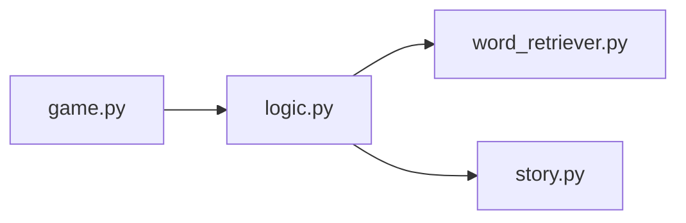
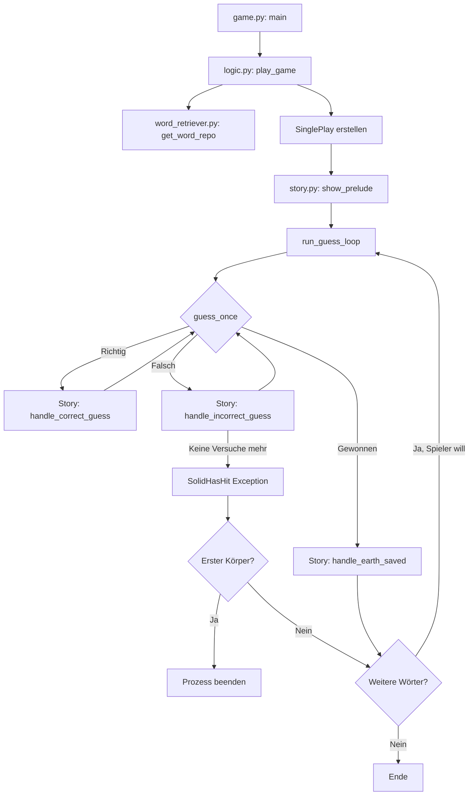

# Projekt: Polyshooter

**Python Version:** Python 3.14

- [Projekt: Polyshooter](#projekt-polyshooter)
  - [1. Beschreibung der Spielfunktionen](#1-beschreibung-der-spielfunktionen)
  - [2. Architekturbeschreibung](#2-architekturbeschreibung)
    - [2.1 Projektstruktur](#21-projektstruktur)
    - [2.2 Hauptmodule](#22-hauptmodule)
      - [game](#game)
      - [word\_retriever](#word_retriever)
      - [logic](#logic)
      - [story](#story)
    - [2.3 Zusammenspiel](#23-zusammenspiel)
  - [3. Programmablauf](#3-programmablauf)
  - [4. Benutzerinteraktionen](#4-benutzerinteraktionen)
  - [5. Code-Analyse-Ergebnisse](#5-code-analyse-ergebnisse)
    - [Testergebnisse / Coverage](#testergebnisse--coverage)
    - [Pylint](#pylint)
    - [MyPy](#mypy)
  - [6. Versionsangabe verwendeter Bibliotheken](#6-versionsangabe-verwendeter-bibliotheken)
  - [7. Anhang](#7-anhang)
    - [Nutzung KI-basierter Werkzeuge](#nutzung-ki-basierter-werkzeuge)
    - [Quellen](#quellen)

## 1. Beschreibung der Spielfunktionen

Dieses Programm ist ein Hangman-artiges Spiel, um [Johnson-Körper](https://de.wikipedia.org/wiki/Johnson-K%C3%B6rper) zu erraten. Diese sind spezielle Polyeder. Eine tiefere Beschreibung sowie eine vollständige Liste befindet sich in dem hinterlegten Link.

Die Geschichte hinter diesem Spiel ist, dass sich über der Erde ein Portal geöffnet hat und diese Körper herunterfallen, welche beim Einschlagen einen Krater hinterlassen. Es gibt einen Laser, welcher sich so kalibrieren kann, dass er den Polyeder vernichten kann. Dafür muss dieser aber den Aufbau des Körpers kennen, was der Spieler errät.

Diese Story wird dem Spieler anfangs angezeigt, welche er mit 's' überspringen kann oder eben lesen kann. Danach fängt das Spiel an. Dabei gibt er einzelne Buchstaben ein. Diese werden getestet, ob sie valide (alphabetisch oder Leerzeichen) sind. Wenn nicht, werden sie ignoriert. Außerdem werden sie zusätzlich zu Kleinbuchstaben konvertiert. Der Nutzer kann auch ein komplettes Wort eingeben – wenn das aber falsch ist, hat er sofort verloren.

Als nächstes wird geschaut, ob das zu erratende Wort diesen Buchstaben enthält. Wenn ja, werden alle Aufkommen des Buchstabens im nächsten Zug aufgedeckt. Wenn nein, zeigt die Anzeige an, dass der Johnson-Körper um 12 Kilometer näher gekommen ist.

Nachdem alle Buchstaben aufgedeckt wurden, schießt der Laser seinen Schuss und der Spieler wird gefragt, ob er nochmal spielen will. Der nächste Körper fällt jedoch in eine andere Richtung, sodass der Spieler nicht verpflichtet ist, weiter zu spielen.
Wenn der Polyeder aber eingeschlagen ist, das heißt, der Spieler hat 6 Fehlversuche gehabt und den nächsten Buchstaben falsch geraten, wird das Programm beendet. Er wird nicht nach einem erneuten Spielen gefragt, da der Spieler im Spiel nicht mehr existiert.

## 2. Architekturbeschreibung

### 2.1 Projektstruktur

```txt
.
├── .github
│   └── workflows
│       └── validate.yml
├── .gitignore
├── .mypy_cache
├── .vscode
│   └── settings.json
├── documentation
│   └── documentation.md
├── mypy.ini
├── README.md
├── requirements.txt
├── source
│   ├── game.py
│   ├── logic.py
│   ├── story.py
│   ├── word_retriever.py
│   └── wordrepo.txt
└── tests
    ├── test_game.py
    ├── test_logic.py
    ├── test_story.py
    └── test_word_retriever.py
```

(Dieses Diagramm wurde mittels `eza -ah -T --git-ignore` erstellt.)

### 2.2 Hauptmodule

#### game

Hier ist der Eintrittspunkt des Spieles. Es wird lediglich die Funktion `play_game` von dem Modul [logic](#logic) aufgerufen.

#### word_retriever

- **`get_word_repo`**

  Diese Funktion liest eine Datei ein und gibt die Zeilen in einer zufälligen Reihenfolge als Liste von Strings zurück. Außerdem ersetzt sie spezielle Buchstaben mittels der `replace_special_chars`-Funktion.

- **`replace_special_chars`**

  Ersetzt die Umlaute (ä -> ae, Ö -> Oe, usw.) und das Eszett (ß -> ss). Entfernt die Klammern, welche in ein paar Johnson-Körpern enthalten sind.

#### logic

Hier befindet sich die hauptsächliche Spiellogik mit der game-loop.

- **`play_game`**

    Dies ist der Einstiegspunkt. Zuerst wird die Wortliste von dem Modul [word_retriever](#word_retriever) erstellt. Dann erstellen wir eine `SinglePlay`-Instanz, zeigen die Vorgeschichte und lassen den Spieler via `run_guess_loop` spielen. Wenn er fertig ist, wird er in eine while-loop geworfen, wo er dann solange noch Wörter in der Wortliste enthalten sind, weiterspielen kann, ohne die Vorgeschichte nochmals angezeigt zu bekommen.

- **`run_guess_loop`**

    Lässt den Spieler ein Wort raten. Wir rufen die Methode `guess_once` von der `SinglePlay` Klasse auf, um zu spielen, ohne, dass angezeigt wird, dass der letzte Versuch ungültig war (deshalb wird `True` übergeben).

    Danach lassen wir den Spieler so lange spielen, bis entweder `guess_once` `True` zurückgibt, oder eine `SolidHasHit`-Exception geworfen wird. Im letzteren Fall ist es wichtig zu unterscheiden, ob es das erste Wort war (und somit der Körper Richtung Spieler fällt) oder nicht (wodurch der Spieler eine zweite Chance bekommt). Das wurde so gemacht, da die Exception von der `Story`-Instanz von dem [Story-Modul](#story) geworfen wird. Diese entscheidet, wann das Spiel verloren ist, was abhängig von der Anzahl an Fehlversuchen ist. Das Spiel ist jedoch immer gewonnen, wenn der Spieler alle Buchstaben erraten hat, weshalb das direkt in der Spiellogik validiert werden kann.

- **`SinglePlay`**

    Eine Klasse, welche ein Spiel für ein einziges Wort abstrahiert.
    Sie enthält das zu erratende Wort selbst und ein Hash-Set mit den Buchstaben des Wortes, um Duplikate zu vermeiden und auf eine einfache Weise das Verhältnis an richtig geratenen und insgesamt vorhandenen Buchstaben zu bekommen. Außerdem zwei Sets mit jeweils den richtig und falsch geratenen Buchstaben. Sie enthält außerdem eine `Story`-Instanz für das Anzeigen relevanter Informationen.

  - **`guess_once`**
  
    Lässt den Spieler einen Buchstaben eingeben. Dafür zeigt es die aktuellen Informationen an (das versteckte Wort, das Verhältnis, Anzahl verbleibender Versuche und die richtig und falsch erratenen Buchstaben). Danach lässt es den Spieler via `__add_input` die validierte Eingabe des Nutzers hinzufügen.

  - **`get_word`**

    Geht durch die Buchstaben des zu erratenen Wortes und gibt sie aus, falls wir sie erraten haben. Falls nicht, wird `_` ausgegeben.

  - **`__add_input`**

    Schaut, ob der Buchstabe von der Eingabe in der Wortliste enthalten ist.
    Falls ja: fügt den Buchstaben zu der Richtige-Buchstaben-Liste hinzu, falls er noch nicht darin enthalten ist und informiert die `Story`-Instanz.
    Falls nein: fügt ihn zu der Falschen-Buchstaben-Liste hinzu, falls er noch nicht darin enthalten ist und informiert ebenso die `Story`-Instanz.

    Wenn die Eingabe mehr als einen Buchstaben enthält, wird diese komplett mit dem tatsächlichen Wort verglichen. Wenn sie nicht gleich sind, verliert der Spieler, sonst hat er gewonnen.

    Falls der Spieler gewonnen hat (die Länge der korrekt erratenen Buchstaben gleich der Länge des Buchstaben-Sets ist), wird von der Story etwas ausgegeben und `True` zurückgegeben. Falls nicht, wird `False` zurückgegeben.

  - **`__get_whole_word`**

    Gibt das als Liste von Buchstaben gespeicherte Wort als Zeichenkette zurück.

- **`validate_input`**

    Filtert alle nicht alphabetischen Buchstaben und nicht Leerzeichen aus einem String heraus und wandelt sie zu Kleinbuchstaben um. Das garantiert, dass der Spieler sowohl Groß- als auch Kleinbuchstaben eingeben kann, und es von der Logik nichts ändert. Außerdem werden somit nicht valide Eingaben ignoriert.

#### story

Dieses Modul kümmert sich um das "Story-Telling". Es zeigt Informationen und Hintergrundgeschichten dem Nutzer an und ist somit vollkommen abgekapselt von der [Spiellogik](#logic). Sie enthält hauptsächlich die Klasse `Story` und die `SolidHasHit` Exception.

- **`Story`**

    Die Klasse enthält die verbleibenden Versuche und ob der Nutzer eine ungültige, falsche oder richtige Eingabe hatte.

  - **`show_prelude`**

    Zeigt die Vorgeschichte an. Der Nutzer kann diese aber auch überspringen.

  - **`show_continuing_scene`**

    Zeigt die Geschichte an, wenn der Spieler gewonnen hat und die Chance hat, nochmal zu spielen. Sie gibt auch die Entscheidung des Spielers zurück: `True`, falls er nochmal spielen will und sonst `False`.

  - **`handle_correct_guess`**

    Setzt `__was_correct_guess` auf eins (= richtiger Versuch)

  - **`handle_incorrect_guess`**

    Dekrementiert die Anzahl an verbleibenden Versuchen. Falls diese null sind, wird `self.__handle_game_over()` aufgerufen. Falls nicht, wird `__was_correct_guess` auf minus eins gesetzt (= falscher Versuch).

  - **`__handle_game_over`**

    Wirft die `SolidHasHit`-Exception.

  - **`handle_earth_saved`**

    Gibt die Feuer-Sequenz für den Laser aus.

  - **`display_guess_feedback`**

    Gibt aus, ob der letzte Versuch richtig oder falsch war. Setzt `__was_correct_guess` wieder auf 0 und gibt die vollständigen Listen der richtig und falsch erratenen Charaktere aus.

  - **`display_calibration`**

    Zeigt das Verhältnis von der Anzahl an bereits richtig erratenen Buchstaben und der Anzahl an verschiedener Buchstaben im gesuchten Wort an. Außerdem wird ein kleines Bild ausgegeben, wie weit der Körper von der Erde entfernt ist.

- **`SolidHasHit`**

    Eine Exception, welche geworfen wird, wenn der Spieler die maximale Anzahl an Fehlversuchen erreicht hat.

### 2.3 Zusammenspiel

Das folgende Diagramm zeigt die statischen Abhängigkeiten zwischen den Modulen:



(Erstellt mit Claude Opus 4.6)

`logic.py` ist das zentrale Modul und koordiniert den gesamten Spielablauf. `story.py` ist dabei vollständig von der Spiellogik entkoppelt, bei einem Spielverlust wird die `SolidHasHit`-Exception von `story.py` geworfen und in `logic.py` abgefangen. `word_retriever.py` ist ein reines Hilfsmodul ohne Abhängigkeiten zu anderen Spielmodulen.

## 3. Programmablauf

Der dynamische Ablauf des Programms zur Laufzeit wird im folgenden Flowchart dargestellt:



(Erstellt mit Claude Opus 4.6)

## 4. Benutzerinteraktionen

**Anfangsgeschichte:** Zu Beginn wird dem Spieler die Vorgeschichte in mehreren Abschnitten angezeigt. Nach jedem Abschnitt kann er mit Enter fortfahren oder mit `s` die restliche Story überspringen. Die Eingabe wird dabei getrimmt und zu Kleinbuchstaben konvertiert, sodass auch `S` oder ` s ` akzeptiert werden.

**Raten:** Während des eigentlichen Spiels gibt der Spieler pro Zug eine Eingabe ein. Diese wird durch `validate_input`, wie im [Logik-Abschnitt](#logic) beschrieben wurde, gefiltert. Dabei gibt es für ihn zwei Möglichkeiten:

- **einzelner Buchstabe:** Ist dieser im gesuchten Wort enthalten, werden alle Vorkommen aufgedeckt. Wenn nicht, rückt der Körper 12.000 km näher. Bereits geratene Buchstaben (ob richtig oder falsch) haben keine Auswirkung.
- **mehrere Buchstaben:** Falls die Eingabe mehr als ein Zeichen enthält, wird sie als Versuch gewertet, das gesamte Wort zu erraten. Stimmt sie überein, hat der Spieler gewonnen. Andernfalls hat er sofort verloren.
- leere Eingaben werden ignoriert

**Weiterspielen:** Nach einem gewonnenen Wort wird der Spieler gefragt, ob er weiterspielen möchte. Hier zählt lediglich `y` ("yes") als Zustimmung, alles andere beendet das Spiel. Die Eingabe wird hier aber genauso getrimmt und zu Kleinbuchstaben konvertiert. Wenn der Spieler hingegen verliert, während der Körper auf ihn zufliegt (erstes Wort), wird der Prozess direkt beendet, ohne eine weitere Eingabemöglichkeit.

## 5. Code-Analyse-Ergebnisse

Die Code-Qualität wird durch eine CI-Pipeline auf GitHub sichergestellt. Bei jedem Push wird automatisch ein Workflow (validate.yml) ausgeführt, der Pylint, MyPy und die Tests mit Coverage auf Python 3.14 ausführt. Die Coverage muss dabei mindestens 75% betragen, sonst schlägt die Pipeline fehl.

### Testergebnisse / Coverage

```txt
Ran 39 tests in 0.004s

OK
Name                       Stmts   Miss  Cover
----------------------------------------------
source/game.py                 5      1    80%
source/logic.py               82     12    85%
source/story.py               85     18    79%
source/word_retriever.py      27      2    93%
----------------------------------------------
TOTAL                        199     33    83%
```

(Ausgabe von `python3.14 -m coverage run --source=source -m unittest discover tests/ && python3 -m coverage report`)

### Pylint

```txt
--------------------------------------------------------------------
Your code has been rated at 10.00/10 (previous run: 10.00/10, +0.00)
```

(entspricht der Ausgabe von `pylint source/`. Der Test-Ordner wird ignoriert.)

### MyPy

```txt
Success: no issues found in 4 source files
```

(entspricht der Ausgabe von `mypy .`)

## 6. Versionsangabe verwendeter Bibliotheken

```txt
astroid==4.0.4
coverage==7.13.5
dill==0.4.1
isort==8.0.1
librt==0.8.1
mccabe==0.7.0
mypy==1.19.1
mypy_extensions==1.1.0
pathspec==1.0.4
platformdirs==4.9.4
pylint==4.0.5
tomlkit==0.14.0
typing_extensions==4.15.0
```

(entspricht der Ausgabe von `pip3 freeze`)

## 7. Anhang

### Nutzung KI-basierter Werkzeuge

| Werkzeug             | Beschreibung der Nutzung                                                                                                                                                                                                                                                                                                                                                                                                                                                                                                                                                                                               |
| -------------------- | ---------------------------------------------------------------------------------------------------------------------------------------------------------------------------------------------------------------------------------------------------------------------------------------------------------------------------------------------------------------------------------------------------------------------------------------------------------------------------------------------------------------------------------------------------------------------------------------------------------------------- |
| Claude Opus 4.6      | <ul><li>Geholfen, Pylint, MyPy und coverage in den Continuous-Integration-Prozess zu bringen.</li><li>Verbessern der Tests: <ul><li>den Fix mit `sys.path.insert(0, os.path.join(os.path.dirname(__file__), '..', 'source'))` gebracht</li><li>beim Schreiben der Tests selbst: Da die Folien dazu nicht mehr auf Moodle zugänglich waren, wusste ich nicht mehr, wie das genau mit dem Mocking & patchen geht</li></ul></li><li>Erstellen von Mermaid-Diagrammen in dieser Dokumentation (wurde jeweils darunter angemerkt)</li><li>Beheben von Inkonsistenzen und Ausdrucksfehlern in dieser Dokumentation</li></ul> |
| Gemini 3 Flash & Pro | <ul><li>Johnson-Körper mit dem Hangman-Spiel zu verbinden (dabei die Idee mit dem aus einem Portal fallenden Körper)</li><li>Inspiration für eine hübschere Darstellung in der Konsolenausgabe</li><li>Eine vollständige Liste der Johnson-Körper aus Wikipedia; manuelles Abschreiben würde zu lange dauern (wurde natürlich überprüft)</li></ul>                                                                                                                                                                                                                                                                     |

### Quellen

- [Coverage](https://coverage.readthedocs.io/en/7.13.5/)
- [Johnson-Körper](https://de.wikipedia.org/wiki/Johnson-K%C3%B6rper)
